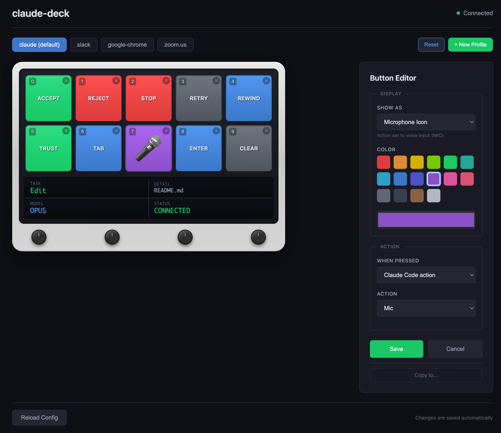

# Claude Deck

A hardware controller for [Claude Code](https://claude.ai/claude-code) using the AJAZZ AKP05E / Mirabox N4 macro pad
with LCD buttons and rotary encoders.


## Features

- **10 LCD buttons** with custom labels, emojis, images, or animated GIFs
- **4 rotary encoders** for brightness, model selection, history navigation, and system volume
- **LCD strip** showing connection status, current model, task info, and volume overlay
- **Web configuration UI** for customizing buttons and profiles
- **Multi-app profiles** - automatically switches button layouts based on focused app
- **Custom keyboard shortcuts** - configure any key with modifiers (⌘⇧⌥⌃)
- **Voice dictation** integration via macOS dictation (double-tap Right Command)
- **Claude Code hooks** for real-time status updates
- **Startup animation** - rainbow wave effect on device connect
- **Auto-reconnect** - gracefully handles device disconnect/reconnect
- **Lock screen detection** - automatically disables input when macOS is locked

## Requirements

- macOS (uses macOS-specific keystroke injection and dictation)
- Rust toolchain
- AJAZZ AKP05E or Mirabox N4 device

## Installation

```bash
# Clone the repository
git clone https://github.com/carlpayne/claude-deck.git
cd claude-deck

# Build
cargo build --release

# Run
cargo run --release
```

### Optional: Install Autostart

```bash
# Install as macOS LaunchAgent (runs on login)
cargo run -- --install-autostart
```

### Optional: Install Claude Code Hooks

```bash
# Install hooks for real-time status updates on LCD strip
cargo run -- --install-hooks
```

## Web Configuration UI



Claude Deck includes a built-in web server for configuring buttons and profiles.

**Access the configuration UI at: http://localhost:9845**

### Features

- **Device preview** - interactive mockup showing buttons, LCD strip status, and encoder knobs
- **Live LCD status** - real-time display of task, detail, model, and connection status
- **Edit button appearance** - text labels, emojis, custom images, or animated GIFs
- **GIF support** - paste any GIF URL or search Giphy directly (requires API key)
- **Configure actions** - keyboard shortcuts, text input, emoji shortcodes, or built-in Claude actions
- **Keyboard shortcuts** - any key with Mac modifiers (⌘ Command, ⇧ Shift, ⌥ Option, ⌃ Control)
- **Auto-submit** - optionally press Enter after typing text/emoji
- **Drag to reorder** - drag buttons to swap positions
- **Copy buttons** - duplicate a button's config to another position
- **Reset buttons** - click ✕ on any button to reset it, or reset entire profile to defaults
- **Create profiles** - profiles for any installed macOS application
- **Button tooltips** - hover over buttons to see what action they perform
- **Live preview** - see changes reflected on the device immediately

### Creating a Profile for a New App

1. Open the web UI at http://localhost:9845
2. Click **+ New Profile**
3. Select an application from the dropdown (auto-detected from /Applications)
4. Optionally copy buttons from an existing profile
5. Customize buttons for your use case

## Default Button Layout

```
┌─────────────────────────────────────────────────────────────┐
│  [ACCEPT]  [REJECT]  [STOP]  [RETRY]  [REWIND]   Top Row    │
│   green     red       red     gray     blue                 │
│                                                             │
│  [TRUST]   [TAB]     [MIC]   [ENTER]  [CLEAR]   Bottom Row  │
│   green    blue     purple    blue     gray                 │
└─────────────────────────────────────────────────────────────┘

┌─────────────────────────────────────────────────────────────┐
│  (Encoder 0)  (Encoder 1)  (Encoder 2)  (Encoder 3)         │
│   Volume        Model        History     Brightness         │
└─────────────────────────────────────────────────────────────┘

┌─────────────────────────────────────────────────────────────┐
│  TASK            │  DETAIL                    LCD Strip     │
│  Bash            │  running tests...                        │
├──────────────────┼──────────────────────────────────────────│
│  MODEL           │  STATUS                                  │
│  OPUS            │  CONNECTED                               │
└─────────────────────────────────────────────────────────────┘
```

## Button Actions

### Top Row (Default Claude Profile)

| Button     | Color | Action                                |
|------------|-------|---------------------------------------|
| **ACCEPT** | Green | Send Enter (select "Yes" option)      |
| **REJECT** | Red   | Send Escape (cancel/reject)           |
| **STOP**   | Red   | Send Escape (interrupt Claude)        |
| **RETRY**  | Gray  | Send Up + Enter (re-run last command) |
| **REWIND** | Blue  | Send double Escape (dismiss/go back)  |

### Bottom Row (Default Claude Profile)

| Button    | Color  | Short Press                         | Long Press (2s)                    |
|-----------|--------|-------------------------------------|------------------------------------|
| **TRUST** | Green  | Send `2` (select "don't ask again") | -                                  |
| **TAB**   | Blue   | Send Tab                            | Open new terminal with Claude Code |
| **MIC**   | Purple | Toggle voice dictation              | Clear current line (Ctrl+U)        |
| **ENTER** | Blue   | Send Enter                          | -                                  |
| **CLEAR** | Gray   | Send `/clear` + Enter               | -                                  |

### Configurable Action Types

| Action Type            | Description                                          | Example                           |
|------------------------|------------------------------------------------------|-----------------------------------|
| **Claude Code action** | Built-in actions (ACCEPT, REJECT, MIC, etc.)         | MIC, CLEAR, TRUST                 |
| **Keyboard key**       | Single key or shortcut with modifiers                | `Cmd+R`, `Option+Cmd+Right`, `F5` |
| **Type text**          | Types the specified text (+ optional auto-submit)    | `/help`, `git status`             |
| **Emoji shortcode**    | Types Slack-style shortcode (+ optional auto-submit) | `:+1:`, `:tada:`                  |

## Encoder Actions

| Encoder             | Rotate                          | Press                                           |
|---------------------|---------------------------------|-------------------------------------------------|
| **0** (Volume)      | Adjust system volume (±5%)      | Replay startup animation                        |
| **1** (Model)       | Cycle through opus/sonnet/haiku | Confirm model selection (sends `/model {name}`) |
| **2** (History)     | Navigate history (Up/Down)      | Select option (Enter)                           |
| **3** (Brightness)  | Adjust brightness (±20%)        | Jump to bottom (End)                            |

The leftmost encoder controls macOS system volume. A volume overlay with a color-coded progress bar appears on the LCD strip for 2 seconds after each adjustment (green normally, orange above 80%, red when muted). The volume state also syncs with external changes made via macOS keyboard shortcuts or menu bar.

## LCD Strip Panels

The LCD strip shows 4 status quadrants:

| Quadrant   | Description                                              |
|------------|----------------------------------------------------------|
| **TASK**   | Current task name from Claude Code hooks (e.g., "Bash", "Thinking") |
| **DETAIL** | Additional context - tool being used, file path, etc.    |
| **MODEL**  | Current model (OPUS/SONNET/HAIKU) with selection UI      |
| **STATUS** | Connection indicator (CONNECTED/OFFLINE/LOCKED) or volume overlay |

When the leftmost encoder is rotated, STATUS temporarily shows a volume bar with percentage for 2 seconds before reverting to the connection indicator. When the macOS screen is locked, STATUS shows "LOCKED" and all button input is disabled for security.

## Multi-App Support

The deck automatically detects which application is focused and switches button layouts accordingly.

### Built-in Profiles

#### Claude Profile (Default)

Matches all apps (`*`) - Standard Claude Code control buttons.

#### Slack Profile

When Slack is focused, buttons switch to emoji reaction shortcuts:

```
┌─────────────────────────────────────────────────────────────┐
│    [👍]      [👎]      [✅]      [👀]      [🎉]    Top Row │
│    :+1:     :-1:    :check:   :eyes:   :tada:               │
│                                                             │
│    [❤️]      [😂]      [🔥]      [💯]      [🙏]  Bottom Row│
│   :heart:   :joy:    :fire:    :100:   :pray:               │
└─────────────────────────────────────────────────────────────┘
```

### Custom App Profiles

Create profiles for any application via the web UI, e.g.:

- **Google Chrome** - Tab navigation, refresh, dev tools
- **VS Code** - Build, debug, git shortcuts
- **Figma** - Zoom, tools, export
- **Any app** - Customize buttons for your workflow

## Configuration

Configuration file location: `~/.config/claude-deck/config.toml`

```toml
# Device settings
[device]
brightness = 80        # LCD brightness (0-100)
idle_timeout = 300     # Seconds before dimming (not yet implemented)

# Terminal for new sessions (long-press TAB)
[new_session]
terminal = "Terminal"  # Or "iTerm"

# Available models for the model selector encoder
[models]
available = ["opus", "sonnet", "haiku"]
default = "opus"

# Profiles are auto-generated and managed via web UI
# You can also edit them manually:
[[profiles]]
name = "claude"
match_apps = ["*"]

[[profiles.buttons]]
position = 0
label = "ACCEPT"
color = "#00C864"
bright_color = "#32DC82"
[profiles.buttons.action]
type = "custom"
value = "ACCEPT"
```

## CLI Options

```bash
claude-deck [OPTIONS]

Options:
  --status              Check device connection status and exit
  --brightness <N>      Set device brightness (0-100)
  --install-autostart   Install macOS LaunchAgent for autostart
  --uninstall-autostart Remove macOS LaunchAgent
  --install-hooks       Install Claude Code hooks for status updates
  --uninstall-hooks     Remove Claude Code hooks
  --help                Print help
  --version             Print version
```

## Troubleshooting

### Recommended startup order

For best results, **start claude-deck first, then connect the device**:

1. Run `cargo run --release`
2. Plug in the device

The app will retry until it finds the device, and this timing works well with the device's boot sequence.

### Device not displaying anything

If the device gets into a bad state:

1. Quit claude-deck
2. Unplug the device
3. Wait 3 seconds
4. Start claude-deck again
5. Plug in the device

### Voice dictation not working

1. Enable dictation in macOS: System Settings → Keyboard → Dictation
2. Set the shortcut to "Press Right Command Key Twice"
3. First use may require a "warm-up" press

### Buttons not responding to Claude Code prompts

Claude Code uses different prompt types:

- **Numbered options** (1, 2, 3) - Use ACCEPT (Enter) or TRUST (2)
- **Yes/No prompts** - Use ACCEPT (Enter) or REJECT (Escape)

## Architecture

```
claude-deck/
├── src/
│   ├── main.rs          # CLI entry point
│   ├── lib.rs           # Main app logic, startup animation
│   ├── config.rs        # Configuration handling
│   ├── device/          # HID device communication
│   │   ├── manager.rs   # Device connection & I/O
│   │   ├── protocol.rs  # Device constants
│   │   └── buttons.rs   # Button labels & descriptions
│   ├── display/         # LCD rendering
│   │   ├── renderer.rs  # Image rendering
│   │   ├── buttons.rs   # Button image generation
│   │   ├── emoji.rs     # Twemoji rendering
│   │   ├── gif.rs       # GIF animation support
│   │   └── strip.rs     # LCD strip panels
│   ├── input/           # Input handling
│   │   ├── handler.rs   # Event processing
│   │   └── keystrokes.rs# Keystroke injection
│   ├── state/           # Application state
│   │   └── manager.rs   # State management
│   ├── hooks/           # Claude Code integration
│   │   └── status.rs    # Status file parsing
│   ├── profiles/        # App-specific button profiles
│   │   ├── mod.rs       # Profile manager & defaults
│   │   └── store.rs     # Profile serialization
│   ├── web/             # Web configuration UI
│   │   ├── server.rs    # Axum web server
│   │   ├── handlers.rs  # API endpoints
│   │   └── types.rs     # API types
│   └── system/          # OS integration
│       └── mod.rs       # Focused app detection, volume control, lock screen (macOS)
├── assets/
│   ├── fonts/           # Embedded fonts
│   ├── emoji/           # Twemoji images for button display
│   └── web/             # Web UI (HTML, CSS, JS)
├── hooks/
│   └── claude-deck-hook.sh  # Claude Code hook script
└── Cargo.toml
```

## Dependencies

- **mirajazz** - HID communication with AJAZZ/Mirabox devices
- **enigo** - Cross-platform keystroke injection
- **image/imageproc** - Image rendering for LCD buttons
- **rusttype** - Font rendering
- **tokio** - Async runtime
- **axum** - Web server for configuration UI
- **tracing** - Logging

## License

MIT License - See [LICENSE](LICENSE) for details.

## Acknowledgments

- [mirajazz](https://crates.io/crates/mirajazz) - HID library for AJAZZ devices
- [Claude Code](https://claude.ai/claude-code) - AI coding assistant by Anthropic
- [Twemoji](https://twemoji.twitter.com/) - Emoji graphics for button display
