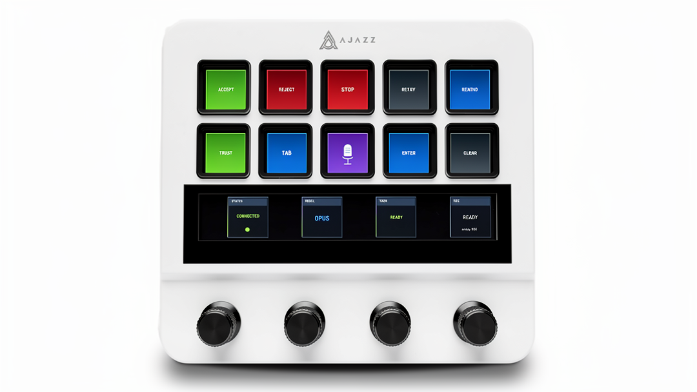

# Claude Deck

A hardware controller for [Claude Code](https://claude.ai/claude-code) using the AJAZZ AKP05E / Mirabox N4 macro pad
with LCD buttons and rotary encoders.


## Features

- **10 LCD buttons** with custom labels and color-coded functions
- **4 rotary encoders** for scrolling, model selection, and navigation
- **LCD strip** showing connection status, current model, task info, and mic status
- **Voice dictation** integration via macOS dictation (double-tap Right Command)
- **Claude Code hooks** for real-time status updates
- **Multi-app support** - automatically switches button layouts based on focused app
- **Slack mode** - emoji reaction shortcuts when Slack is focused
- **Startup animation** - rainbow wave effect on device connect
- **Auto-reconnect** - gracefully handles device disconnect/reconnect

## Requirements

- macOS (uses macOS-specific keystroke injection and dictation)
- Rust toolchain
- AJAZZ AKP05E or Mirabox N4 device

## Installation

```bash
# Clone the repository
git clone https://github.com/carlpayne/claude-deck.git
cd claude-deck

# Build
cargo build --release

# Run
cargo run --release
```

### Optional: Install Autostart

```bash
# Install as macOS LaunchAgent (runs on login)
cargo run -- --install-autostart
```

### Optional: Install Claude Code Hooks

```bash
# Install hooks for real-time status updates on LCD strip
cargo run -- --install-hooks
```

## Button Layout

```
┌─────────────────────────────────────────────────────────────┐
│  [ACCEPT]  [REJECT]  [STOP]  [RETRY]  [REWIND]   Top Row    │
│   green     red       red     gray     blue                 │
│                                                             │
│  [TRUST]   [TAB]     [MIC]   [ENTER]  [CLEAR]   Bottom Row  │
│   green    blue     purple    blue     gray                 │
└─────────────────────────────────────────────────────────────┘

┌─────────────────────────────────────────────────────────────┐
│  (Encoder 0)  (Encoder 1)  (Encoder 2)  (Encoder 3)         │
│   Scroll       Model        History      Reserved           │
└─────────────────────────────────────────────────────────────┘

┌─────────────────────────────────────────────────────────────┐
│  [STATUS]    [MODEL]     [TASK]      [MIC]     LCD Strip    │
│  Connected   OPUS        READY       READY                  │
└─────────────────────────────────────────────────────────────┘
```

## Button Actions

### Top Row

| Button     | Color | Action                                |
|------------|-------|---------------------------------------|
| **ACCEPT** | Green | Send Enter (select "Yes" option)      |
| **REJECT** | Red   | Send Escape (cancel/reject)           |
| **STOP**   | Red   | Send Escape (interrupt Claude)        |
| **RETRY**  | Gray  | Send Up + Enter (re-run last command) |
| **REWIND** | Blue  | Send double Escape (dismiss/go back)  |

### Bottom Row

| Button    | Color  | Short Press                         | Long Press (2s)             |
|-----------|--------|-------------------------------------|-----------------------------|
| **TRUST** | Green  | Send `2` (select "don't ask again") | -                           |
| **TAB**   | Blue   | Send Tab                            | Auto-complete               |
| **MIC**   | Purple | Toggle voice dictation              | Clear current line (Ctrl+U) |
| **ENTER** | Blue   | Send Enter                          | -                           |
| **CLEAR** | Gray   | Send `/clear` + Enter               | -                           |

## Encoder Actions

| Encoder         | Rotate                          | Press                                           |
|-----------------|---------------------------------|-------------------------------------------------|
| **0** (Scroll)  | Page Up/Down                    | Replay startup animation                        |
| **1** (Model)   | Cycle through opus/sonnet/haiku | Confirm model selection (sends `/model {name}`) |
| **2** (History) | Navigate history (Up/Down)      | Select option (Enter)                           |
| **3**           | -                               | Jump to bottom (End)                            |

## LCD Strip Panels

The LCD strip shows 4 status panels:

1. **STATUS** - Connection indicator (CONNECTED/OFFLINE)
2. **MODEL** - Current model (OPUS/SONNET/HAIKU) with selection UI
3. **TASK** - Current task name from Claude Code hooks
4. **MIC** - Dictation status (READY/REC)

## Multi-App Support

The deck automatically detects which application is focused and switches button layouts accordingly.

### Slack Mode

When Slack is the focused application, buttons switch to emoji reaction shortcuts:

```
┌─────────────────────────────────────────────────────────────┐
│    [👍]      [👎]      [✅]      [👀]      [🎉]    Top Row  │
│    :+1:     :-1:    :check:   :eyes:   :tada:              │
│                                                             │
│    [❤️]      [😂]      [🔥]      [💯]      [🙏]  Bottom Row │
│   :heart:   :joy:    :fire:    :100:   :pray:              │
└─────────────────────────────────────────────────────────────┘
```

Pressing a button types the corresponding Slack emoji shortcode (e.g., `:+1:`).

### Claude Mode (Default)

When any other application is focused (Terminal, VS Code, etc.), the standard Claude Code button layout is used.

## Configuration

Configuration file location: `~/.config/claude-deck/config.toml`

```toml
# Example configuration (defaults shown)
brightness = 100
```

## CLI Options

```bash
claude-deck [OPTIONS]

Options:
  --status            Check device connection status and exit
  --brightness <N>    Set device brightness (0-100)
  --install-autostart Install macOS LaunchAgent for autostart
  --install-hooks     Install Claude Code hooks for status updates
  --help              Print help
  --version           Print version
```

## Troubleshooting

### Recommended startup order

For best results, **start claude-deck first, then connect the device**:

1. Run `cargo run --release`
2. Plug in the device

The app will retry until it finds the device, and this timing works well with the device's boot sequence.

### Device not displaying anything

If the device gets into a bad state:

1. Quit claude-deck
2. Unplug the device
3. Wait 3 seconds
4. Start claude-deck again
5. Plug in the device

### Voice dictation not working

1. Enable dictation in macOS: System Settings → Keyboard → Dictation
2. Set the shortcut to "Press Right Command Key Twice"
3. First use may require a "warm-up" press

### Buttons not responding to Claude Code prompts

Claude Code uses different prompt types:

- **Numbered options** (1, 2, 3) - Use ACCEPT (Enter) or TRUST (2)
- **Yes/No prompts** - Use ACCEPT (Enter) or REJECT (Escape)

## Architecture

```
claude-deck/
├── src/
│   ├── main.rs          # CLI entry point
│   ├── lib.rs           # Main app logic, startup animation
│   ├── config.rs        # Configuration handling
│   ├── device/          # HID device communication
│   │   ├── manager.rs   # Device connection & I/O
│   │   ├── protocol.rs  # Device constants
│   │   └── buttons.rs   # Button labels & descriptions
│   ├── display/         # LCD rendering
│   │   ├── renderer.rs  # Image rendering
│   │   ├── buttons.rs   # Button image generation
│   │   └── strip.rs     # LCD strip panels
│   ├── input/           # Input handling
│   │   ├── handler.rs   # Event processing
│   │   └── keystrokes.rs# Keystroke injection
│   ├── state/           # Application state
│   │   └── manager.rs   # State management
│   ├── hooks/           # Claude Code integration
│   │   ├── listener.rs  # Hook event listener
│   │   └── status.rs    # Status file parsing
│   ├── profiles/        # App-specific button profiles
│   │   └── mod.rs       # Claude & Slack button configs
│   └── system/          # OS integration
│       └── mod.rs       # Focused app detection (macOS)
├── assets/
│   ├── fonts/           # Embedded fonts
│   └── emoji/           # Emoji images for Slack mode
├── hooks/
│   └── claude-deck-hook.sh  # Claude Code hook script
└── Cargo.toml
```

## Dependencies

- **mirajazz** - HID communication with AJAZZ/Mirabox devices
- **enigo** - Cross-platform keystroke injection
- **image/imageproc** - Image rendering for LCD buttons
- **rusttype** - Font rendering
- **tokio** - Async runtime
- **tracing** - Logging

## License

MIT License - See [LICENSE](LICENSE) for details.

## Acknowledgments

- [mirajazz](https://crates.io/crates/mirajazz) - HID library for AJAZZ devices
- [Claude Code](https://claude.ai/claude-code) - AI coding assistant by Anthropic
